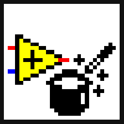

<!-- Based on https://github.com/othneildrew/Best-README-Template -->
<!-- PROJECT SHIELDS -->
<!--
*** I'm using markdown "reference style" links for readability.
*** Reference links are enclosed in brackets [ ] instead of parentheses ( ).
*** See the bottom of this document for the declaration of the reference variables
*** for contributors-url, forks-url, etc. This is an optional, concise syntax you may use.
*** https://www.markdownguide.org/basic-syntax/#reference-style-links
-->
[![Contributors][contributors-shield]][contributors-url]
[![Forks][forks-shield]][forks-url]
[![Stargazers][stars-shield]][stars-url]
[![Issues][issues-shield]][issues-url]
[![BSD-3-Clause License][license-shield]][license-url]

<!-- PROJECT LOGO -->
<br>
<p align="center">
  <a href="https://github.com/logmanoriginal/labview-composition">
    
  </a>

  <h3 align="center">LabVIEW Composition</h3>

  <p align="center">
    Composes and decomposes LabVIEW&trade; data types.
    <br>
    <a href="https://github.com/logmanoriginal/labview-composition"><strong>Explore the docs »</strong></a>
    <br>
    <br>
    <a href="https://github.com/logmanoriginal/labview-composition">View Demo</a>
    <br>
    <a href="https://github.com/logmanoriginal/labview-composition/issues">Report Bug</a>
    <br>
    <a href="https://github.com/logmanoriginal/labview-composition/issues">Request Feature</a>
  </p>
</p>

<!-- ABOUT THE PROJECT -->
## About The Project

Composes and decomposes objects, clusters, maps and sets in LabVIEW, effectively breaking [encapsulation](https://en.wikipedia.org/wiki/Encapsulation_(computer_programming)) by making private data accessible. Use with caution!

### Built With

* [LabVIEW&trade;](https://www.ni.com/labview)

<!-- GETTING STARTED -->
## Getting Started

To get a local copy up and running follow these simple steps.

### Prerequisites

* LabVIEW&trade; 2017 or later
* VI Package Manager

### Installation

1. Clone the repo
   ```sh
   git clone https://github.com/logmanoriginal/labview-composition.git
   ```
2. Install packages
   ```sh
   start .vipc
   ```
   Or apply `.vipc` manually.

<!-- USAGE EXAMPLES -->
## Usage

Here is an example that takes an object and writes new data to it.


<!-- ROADMAP -->
## Roadmap

See the [open issues](https://github.com/logmanoriginal/labview-composition/issues) for a list of proposed features (and known issues).

<!-- CONTRIBUTING -->
## Contributing

Contributions are what make the open source community such an amazing place to be learn, inspire, and create. Any contributions you make are **greatly appreciated**.

1. Fork the Project
2. Create your Feature Branch (`git checkout -b feature/AmazingFeature`)
3. Commit your Changes (`git commit -m 'Add some AmazingFeature'`)
4. Push to the Branch (`git push origin feature/AmazingFeature`)
5. Open a Pull Request

Keep in mind that LabVIEW&trade; VIs are binary files, which are difficult to merge.
- Only change a single VI or library.
- Avoid conflicts with other pull requests (don't work on the same libraries or VIs).
- Send VI Snippets (via issues) instead of pull requests when possible.

<!-- LICENSE -->
## License

Distributed under the BSD-3-Clause License. See [`LICENSE`](LICENSE.txt) for more information.

<!-- CONTACT -->
## Contact

Project Link: [https://github.com/logmanoriginal/labview-composition](https://github.com/logmanoriginal/labview-composition)

<!-- ACKNOWLEDGEMENTS -->
## Acknowledgements

* [Caraya Unit Test Framework](https://github.com/JKISoftware/Caraya)

<!-- MARKDOWN LINKS & IMAGES -->
<!-- https://www.markdownguide.org/basic-syntax/#reference-style-links -->
[contributors-shield]: https://img.shields.io/github/contributors/logmanoriginal/labview-composition.svg?style=for-the-badge
[contributors-url]: https://github.com/logmanoriginal/labview-composition/graphs/contributors
[forks-shield]: https://img.shields.io/github/forks/logmanoriginal/labview-composition.svg?style=for-the-badge
[forks-url]: https://github.com/logmanoriginal/labview-composition/network/members
[stars-shield]: https://img.shields.io/github/stars/logmanoriginal/labview-composition.svg?style=for-the-badge
[stars-url]: https://github.com/logmanoriginal/labview-composition/stargazers
[issues-shield]: https://img.shields.io/github/issues/logmanoriginal/labview-composition.svg?style=for-the-badge
[issues-url]: https://github.com/logmanoriginal/labview-composition/issues
[license-shield]: https://img.shields.io/github/license/logmanoriginal/labview-composition.svg?style=for-the-badge
[license-url]: https://github.com/logmanoriginal/labview-composition/blob/master/LICENSE.txt
